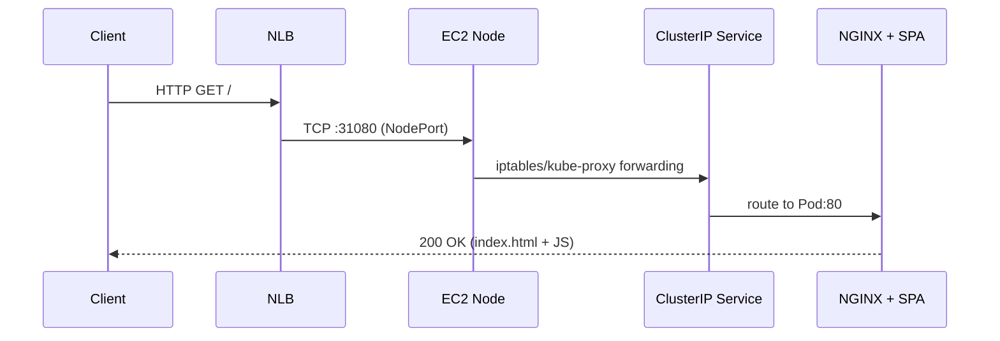

# Architecture

This project provisions a **minimal, low-cost Amazon EKS environment** for quick experiments and demos. It avoids NAT Gateways and uses ARM micro nodes to keep costs low, while still supporting an internet-facing workload via an NLB.

> Template: `infra/cloudformation/eks-mini.json`  
> Defaults: Kubernetes **1.30**, node type **t4g.micro** (ARM64), desired/min/max **2/1/2**, root volume **20 GiB**.

---

## What gets created

### Networking (VPC)
- **VPC** `10.0.0.0/16` with DNS support enabled.
- **2 public subnets** (in different AZs), each tagged for Kubernetes LBs:
  - `kubernetes.io/role/elb=1`
  - `kubernetes.io/cluster/<ClusterName>=shared`
- **Internet Gateway** and a **public route table** with `0.0.0.0/0 → IGW`.

### EKS control plane
- **EKS Cluster** (v**1.30**), name parameterized.
- **Public endpoint enabled**; private endpoint off by default (can be enabled post-create).
- **Managed add-ons:** `vpc-cni`, `coredns`, `kube-proxy`.

### IAM
- **Cluster role:** `AmazonEKSClusterPolicy`, `AmazonEKSVPCResourceController`.
- **Node role:** `AmazonEKSWorkerNodePolicy`, `AmazonEKS_CNI_Policy`, `AmazonEC2ContainerRegistryReadOnly`.

### Compute
- **Managed Node Group** (MNG):
  - Instance type **t4g.micro** (ARM64), AMI type `AL2023_ARM_64_STANDARD`.
  - Scaling parameters (Desired/Min/Max), on-demand capacity, disk size parameterized.
  - Nodes placed across the two public subnets.

### Sample application (k8s manifests under `k8s/`)
- `Deployment` (NGINX + React SPA) with `nodeSelector: kubernetes.io/arch=arm64`.
- `Service type=LoadBalancer` with an **internet-facing NLB** (instance targets).
- **Fixed NodePort `31080`** to simplify security-group rules.

> **Traffic path:** Client → **NLB:80** → **Node private IP:31080 (NodePort)** → **ClusterIP Service** → **Pod**.

---

## Diagram — Logical layout

```mermaid
flowchart LR
  %% declare nodes (no classes inline)
  Internet((Client))
  NLB[NLB (internet-facing)]
  CP["EKS Control Plane (v1.30)<br/>AWS-managed"]

  subgraph VPC["VPC 10.0.0.0/16"]
    IGW[Internet Gateway]
    RT["Public Route Table<br/>0.0.0.0/0 → IGW"]

    subgraph SubnetA["Public Subnet A"]
      NodeA["EC2 Node (ARM64)<br/>MNG"]
    end

    subgraph SubnetB["Public Subnet B"]
      NodeB["EC2 Node (ARM64)<br/>MNG"]
    end
  end

  %% edges
  Internet -->|HTTP:80| NLB
  NLB -->|"TCP:80 → NodePort 31080"| NodeA
  NLB -->|"TCP:80 → NodePort 31080"| NodeB
  NodeA --> SVC[ClusterIP Service]
  NodeB --> SVC
  SVC --> POD[hello Pod (NGINX + SPA)]

  %% control plane relations (dotted)
  CP -. "Kubernetes API (public / opt. private)" .-> NodeA
  CP -.-> NodeB

  %% styles (apply classes after nodes are declared)
  classDef ext fill:#ffffff,stroke:#666,stroke-width:1px;
  classDef alb fill:#eef6ff,stroke:#3b82f6,stroke-width:1px;
  classDef cp  fill:#fff4e5,stroke:#f59e0b,stroke-width:1px;
  classDef net fill:#f3f4f6,stroke:#9ca3af,stroke-width:1px;
  classDef node fill:#ecfdf5,stroke:#10b981,stroke-width:1px;
  classDef svc fill:#ede9fe,stroke:#8b5cf6,stroke-width:1px;
  classDef pod fill:#e0f2fe,stroke:#38bdf8,stroke-width:1px;

  class Internet ext
  class NLB alb
  class CP cp
  class IGW,RT net
  class NodeA,NodeB node
  class SVC svc
  class POD pod
```
```

---

## Diagram — Request sequence



---

## Security model (high level)

- **API access:** `PublicAccessCidrs` controls which CIDRs can reach the public API. Recommended post-create:
  - enable the **private endpoint**, and
  - restrict the **public endpoint** to your current IP.
- **Data plane:** NLB uses **instance targets** → health checks/traffic hit the node **NodePort**. Open **TCP/31080** on:
  - the **worker node security group(s)**, and
  - the **cluster security group** (for mixed attachments).
- **Node bootstrap:** Node IAM role is mapped via `aws-auth` (MNG manages this automatically in most setups).

---

## Cost notes

- **EKS control plane**: hourly charge per cluster.
- **Load balancers**: NLB hourly + LCUs.
- **EC2 nodes**: On-Demand `t4g.micro` (ARM is cost-efficient).
- **EBS**: root volumes for nodes.
- No **NAT Gateway** in this design.

---

## Resource summary (CloudFormation types)

| Component | Type |
|---|---|
| VPC | `AWS::EC2::VPC` |
| Internet Gateway | `AWS::EC2::InternetGateway` |
| Route Table / Route | `AWS::EC2::RouteTable`, `AWS::EC2::Route` |
| Subnets (2x) | `AWS::EC2::Subnet` |
| Subnet Associations | `AWS::EC2::SubnetRouteTableAssociation` |
| EKS Cluster | `AWS::EKS::Cluster` |
| IAM Roles (cluster/node) | `AWS::IAM::Role` |
| Managed Add-ons | `AWS::EKS::Addon` (vpc-cni, coredns, kube-proxy) |
| Managed Node Group | `AWS::EKS::Nodegroup` |

